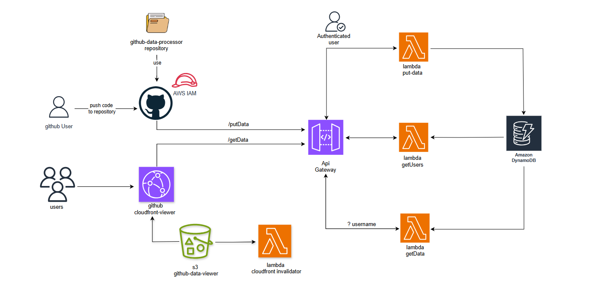

# github-data-viewer

github-data-viewer is one of the 3 github-repo-viewer project that displays the github user's repository data from Amazon AWS.

1. [github-data-processor](https://github.com/ravilladhaneesh/github-data-processor)
2. [github-data-controller](https://github.com/ravilladhaneesh/github-data-controller)
3. github-data-viewer

## Table of Contents

- [Project flow diagram](#project-diagram)
- [Technologies used](#Technologies-Used)
- [Prerequisites](#Prerequisites)
- [Installation](#Installation)
- [To-do](#To-do)

## project-diagram

## Technologies-Used

    1. Terraform
    2. Javascript
    3. HTML/CSS
    4. Python
    5. Github CI/CD

## Prerequisites

    1. Python
    2. Git

## Installation

Steps to run application in local:

    1. Clone the repository using the below command in git bash(or command prompt).
        `git clone https://github.com/ravilladhaneesh/github-viewer.git`
    2. Move to the cloned repository directory
    3. Run the below command in git bash to install required python dependencies.
        `pip install -r requirements.txt`
    4. Navigate to the index.html in src/static using the below command.
        `cd src/static/`
    5. Run the below command to start application in local.
        `python -m http.server 8080`
    6. Open a new tab in the browser and give `http://localhost:8080`

## To-do

1. Add the project source code link in Nav-bar.
2. Add functionality to request access for private repository.

